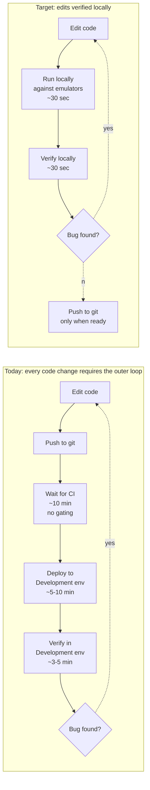

# Business Case: Local Development Environment Investment

**Proposal**: Equip the development team with Docker Desktop and Azure service emulators (Azurite, Cosmos DB Emulator, SQL Edge, Service Bus Emulator, etc.) to enable a working local development environment.

**Asks of management**: Approval for licenses, ~6 weeks of one engineer's time for setup, and team training.

**Expected outcome**: Recover 25-35% of effective sprint capacity, reduce defects escaping to integration by ~67%, payback in under 6 months.

> **Calibrated with real team data (Jan–May 2026):** in a 4.25-month window we observed **26 work items that needed multiple PRs** (mean 3.04 PRs per rework item, max 7), distributed across 7 developers. Annualised: **~73 rework items/year** generating **~119 additional rework PR cycles** that would not exist if developers could verify fixes locally. The 24 measured build durations (critical path ~37 min per PR deployment) confirm the cycle-time tax. See the `Real-Bug-Data`, `Real-Build-Times`, and `Process-Steps` tabs of `cost-model.xlsx`.

---

## Executive summary

Our developers cannot fully run their code locally. Every code change must be pushed to a shared Development environment to be verified, and every bug found there triggers a heavyweight PR-driven workflow that costs **10-15x more than the same bug caught at the developer's desk** (consistent with IBM Systems Sciences Institute's well-known cost-of-defect curve, and corroborated by our team-specific bottom-up calculation from the documented 46-step process).

Our pipeline topology is **Local → Development → Staging → Production**. CI exists but does not gate deployment, which means CI-flagged bugs flow through to the Development environment and are caught there at the higher Development-stage cost. (This is a separate, smaller improvement opportunity discussed at the end.)

Three compounding consequences:

1. **Bug rework is ~18x more expensive than it should be**, because most defects are caught after the 1x stage. Estimated annual cost: **~$350-565k** depending on actual defect volume.
2. **Sprint capacity is eroded by ~33%** because of cycle-time waits — we are paying for 8 developers and getting the output of ~5.3. Estimated annual cost: **~$340-500k**.
3. **Developers have invented workarounds** (shared databases, hardcoded credentials, disabled auth, push-to-test debugging) that compound security risk, cycle time, and onboarding cost.

The investment to fix this is small (~$20-30k/year ongoing in licenses, ~$15-25k one-time for setup and training). The savings are large enough that the **payback period is under six months** under conservative assumptions.

This document and the accompanying spreadsheet (`cost-model.xlsx`) make the math fully transparent and parameterised.

---

## The problem in one diagram

**Today**: every iteration of the inner loop costs 15-25 minutes. Bugs escape to the Development environment or beyond, where they cost 15-100x more to fix.

**Target**: every iteration costs 30-90 seconds. Bugs are caught locally where they cost 1x.

---

## The cost model — four pillars

The cost of the broken inner loop accumulates through four independent, additive channels. Each is modelled in its own spreadsheet tab.

### Pillar 1: Shift-left rework cost

The same defect costs ~1x locally, ~15x in our Development environment, ~40x in staging, ~100x in production (IBM SSI). Today our defect distribution is heavily right-shifted; **every percentage point of detection we move left captures the full multiplier delta**.

> Headline: For 400 defects/year and our placeholder distribution, **annual rework cost is ~$565k today vs ~$232k post-investment ⇒ ~$333k/year savings.**
>
> Full math: [`shift-left-economics.md`](shift-left-economics.md)

### Pillar 2: Development-fix workflow tax

Every bug found in the Development environment triggers a 13-step workflow (branch → fix → AI code-check → push → CI → PR → review rounds → approval → merge → redeploy → reverify → loop). This costs **~$729 of fully-loaded engineering time per fix**, vs ~$78 for a locally-caught fix.

> Headline: For 180 Development-stage bugs/year (45% of 400), ~$82k/year is recoverable by shifting them left.
>
> Note: this overlaps with Pillar 1; the spreadsheet has a `use_bottom_up_multiplier` toggle that prevents double-counting.
>
> Full math: [`development-fix-workflow-cost.md`](development-fix-workflow-cost.md)

### Pillar 3: Cycle-time / sprint capacity erosion

The inner-loop cycle time is currently ~25 min per iteration vs ~2 min target. Across 12 iterations/dev/day and 8 devs, this consumes ~33% of nominal sprint capacity.

> Headline: ~$365k/year of sprint capacity lost to cycle-time waits alone, plus a ~22% story carry-over rate that erodes sprint predictability.
>
> Full math: [`cycle-time-and-sprint-impact.md`](cycle-time-and-sprint-impact.md)

### Pillar 4: Azure DevOps pipeline cost (failed-build retries)

Failed CI builds caused by issues that should have been caught locally trigger full pipeline reruns. Compute cost is small ($5-10k/year); the engineer-idle and retry overhead is large (~$30-50k/year recoverable).

> Headline: ~$32k/year of pipeline retries are directly attributable to the missing local environment.
>
> Full math: [`azure-devops-pipeline-cost.md`](azure-devops-pipeline-cost.md)

---

## Total annual savings (placeholder team: 8 devs, $85/hr loaded)

| Pillar | Annual savings (placeholder) |
|---|---|
| 1. Shift-left rework cost | $333,000 |
| 2. Development-fix workflow tax | included in Pillar 1 (toggle) |
| 3. Sprint capacity recovery | $439,000 |
| 4. Pipeline retry recovery | $39,000 |
| 5. Workarounds eliminated (from self-assessment) | $25,000 - $80,000 |
| **Total annual savings** | **~$836,000 - $891,000** |

These numbers are placeholders. Real figures depend on team size, hourly rate, and current defect distribution — all of which are inputs in `cost-model.xlsx`.

---

## Investment side (honest accounting)

| Item | Cost |
|---|---|
| **One-time costs** | |
| Engineer time to set up emulators, document Docker patterns, write `docker-compose.yml` | 60 hours × $85 = $5,100 |
| Engineer time to write/migrate dev-onboarding documentation | 20 hours × $85 = $1,700 |
| Team training (8 devs × 4 hours) | 32 hours × $85 = $2,720 |
| Optional dev machine RAM/SSD upgrades (estimate) | $4,000 - $8,000 |
| **One-time subtotal** | **$13,520 - $17,520** |
| | |
| **Ongoing annual costs** | |
| Docker Desktop Business licenses (8 devs × $21/mo × 12, for >250-employee orgs) | $2,016 |
| Docker Personal (free) for smaller orgs / individual licenses | $0 |
| Ongoing maintenance of emulator/Docker setup (~5% of one engineer) | ~$8,800 |
| **Ongoing annual subtotal** | **$8,800 - $10,816** |

> **Note on Docker pricing**: Docker Desktop is free for personal use, education, open-source, and small businesses (<250 employees, <$10M revenue). Larger organisations require a paid subscription ($21/user/month for the Business tier). Verify which tier applies to your org. Free alternatives (Podman Desktop, Rancher Desktop) exist if cost is a blocker.

---

## ROI summary

| Metric | Value (placeholder) |
|---|---|
| Total one-time cost | ~$15,500 |
| Total annual ongoing cost | ~$10,500 |
| Annual savings (mid case) | ~$862,000 |
| Annual savings (downside, 25% sensitivity) | ~$646,000 |
| **Net annual savings (downside)** | **~$636,000** |
| **Payback period (downside)** | **< 1 month** |
| **3-year NPV (downside, 10% discount)** | **~$1,500,000** |
| **3-year ROI (downside)** | **~38x investment** |

Even at the most conservative end of the sensitivity range, this is one of the highest-ROI investments available to engineering leadership.

---

## Risks and mitigations

| Risk | Likelihood | Impact | Mitigation |
|---|---|---|---|
| Emulator parity gaps cause bugs that only appear in real Azure | Medium | Medium | Keep CI integration tests against real Azure as a safety net; document known gaps; choose emulators with mature parity (Azurite, Cosmos, SQL Edge are all production-grade). |
| Docker Desktop licensing cost grows if team scales | Low | Low | Cost is linear and predictable; alternatives exist (Podman, Rancher). |
| Setup engineer's time is misjudged | Medium | Low | 60-hour estimate has 25% buffer; even at 100 hours the ROI math doesn't change materially. |
| Team resistance to learning Docker | Low | Medium | 4-hour training session; pair programming during first week of rollout; champions on each squad. |
| Dev machines lack RAM (Docker is heavy) | Medium | Low | Audit machine specs first; budget includes upgrade line. 16 GB minimum, 32 GB recommended. |
| Emulators introduce a new failure mode (broken emulator → "works on my machine, fails in Azure") | Low | Low | Pin emulator versions; document update procedure; CI still tests against real Azure. |

---

## Recommendation

Approve the investment. Phased rollout:

| Phase | Duration | Goals |
|---|---|---|
| **Phase 1: Setup** | 4 weeks | One engineer (lead) builds the `docker-compose.yml`, documents the local setup, validates emulator parity for our top 5 Azure services. |
| **Phase 2: Pilot** | 2 weeks | 2-3 volunteer devs adopt the local env; iterate on the setup based on their friction. |
| **Phase 3: Rollout** | 2 weeks | Whole team migrates. Training session. Each dev's first week supported by the lead. |
| **Phase 4: Measure** | Ongoing | Track success metrics quarterly. |

Total elapsed time: ~8 weeks, with full team productive on the new setup by end of week 8.

---

## Success metrics (track quarterly)

| Metric | Today (placeholder) | 6-month target | 12-month target |
|---|---|---|---|
| **PCE(local)** — % of defects caught locally | 35% | 60% | 75% |
| **Inner-loop cycle time** — median minutes per iteration | 25 min | 8 min | 2 min |
| **Story carry-over rate** | 22% | 12% | 6% |
| **CI failure rate** | 30% | 18% | 10% |
| **PR cycle time for bug-fix PRs** (DORA Lead Time) | 2 days | 1 day | 0.5 day |
| **Defects escaping to Development** (% of total) | 45% | 25% | 18% |
| **Defects escaping to Staging** (% of total) | 15% | 8% | 5% |
| **Defects escaping to Production** (% of total) | 5% | 3% | 2% |

These metrics are also the **post-investment audit trail**: if the savings don't materialise, the metrics will show it within 6 months and the investment can be reconsidered.

---

## A related, complementary improvement: turn on CI gating

While we're proposing this investment, an observation worth raising as a side recommendation:

**Our CI pipeline runs builds, unit tests, and QA tests on every push, but does not block deployment when they fail.** This means CI is currently a *signal* rather than a *containment stage*. Bugs that CI catches at ~6.5x cost (the IBM CI multiplier) end up escaping to the Development environment where they cost ~15x to fix — because the deployment happened anyway.

- **Cost to fix**: an afternoon of platform-engineering work to add a deployment-gating step to the pipeline.
- **Annual savings**: ~$15-30k/year at our placeholder defect volume (5-10% of current Development-stage rework cost).
- **Does it replace the local-env investment?** No. It complements it. Local-env catches bugs *before* CI; CI gating catches what slips past local. They are independent levers.

This is too small to anchor a separate business case on, but it's essentially free and should be done alongside the main investment.

---

## How to verify these numbers

This document uses placeholder defaults from industry benchmarks. To produce numbers credible to your CFO:

1. Pull our actual defect distribution from Azure Boards (queries in [`data-gathering-checklist.md`](data-gathering-checklist.md))
2. Pull our actual PR cycle time from Azure DevOps Analytics
3. Pull our actual loaded hourly rate from Finance
4. Run the 1-week developer time-tracking template in `data-gathering-checklist.md` to measure inner-loop time empirically
5. Plug all of the above into the Inputs tab of `cost-model.xlsx`
6. The ROI Summary and Sensitivity tabs update automatically

The numbers in the deck should be **your numbers**, not the placeholders. The placeholders exist only to demonstrate the model works.

---

## Appendix: documents in this package

| Document | Purpose |
|---|---|
| [`README.md`](README.md) | Index of all artefacts |
| **`business-case.md`** (this file) | The main 5-page argument |
| [`shift-left-economics.md`](shift-left-economics.md) | The IBM cost-of-defect curve, PCE metric, defect distribution math |
| [`development-fix-workflow-cost.md`](development-fix-workflow-cost.md) | Bottom-up cost of the 13-step PR workflow |
| [`cycle-time-and-sprint-impact.md`](cycle-time-and-sprint-impact.md) | Sprint capacity erosion math |
| [`azure-devops-pipeline-cost.md`](azure-devops-pipeline-cost.md) | ADO pricing breakdown |
| [`developer-workarounds.md`](developer-workarounds.md) | Catalogue of 14 workarounds + self-assessment grid |
| [`data-gathering-checklist.md`](data-gathering-checklist.md) | ADO/Jira queries + 1-week time-tracking template |
| [`pitch-deck-outline.md`](pitch-deck-outline.md) | 17-slide deck outline with speaker notes |
| [`cost-model.xlsx`](cost-model.xlsx) | Live Excel model with formulas |
| [`cost-model.py`](cost-model.py) | Generates the xlsx; edit defaults here |
| [`cost-model.csv`](cost-model.csv) | Flat CSV fallback |

---

## Sources cited

- IBM Systems Sciences Institute — cost-of-defect cumulative multiplier (1x → 100x)
- NIST / RTI International (2002) — *The Economic Impacts of Inadequate Infrastructure for Software Testing*
- Capers Jones — *Applied Software Measurement*; *Software Engineering Best Practices* (PCE, DDP benchmarks)
- DORA / Google Cloud — *State of DevOps Report* (annual; lead time, change-failure rate, MTTR)
- Tom DeMarco & Timothy Lister — *Peopleware* (3rd ed.) (context-switch productivity)
- Microsoft — Azure DevOps pricing; inner-loop developer productivity research
- Docker — Docker Desktop subscription pricing
- Gene Kim et al. — *The Phoenix Project* (queueing theory in delivery)
