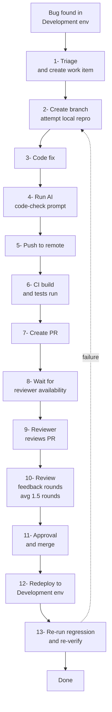

# The Development-Fix Workflow Cost

## TL;DR

Every bug found in the Development environment triggers a **13-step workflow** that consumes ~6-9 hours of developer time and ~1-1.5 hours of reviewer time, *before* any retries. The same bug caught locally costs ~30-60 minutes total. This delta is the mechanism that makes the development-stage 15x multiplier real for our team.

> **Per development-stage bug fix: ~$650-900 of fully-loaded engineering time.**
> **Per locally-caught bug fix: ~$60-80.**
> **Team-specific multiplier: ~10-12x for dev time alone, rising to ~18-25x once reviewer time, queue/wait, and retries are included.**

---

## A note on our pipeline topology

Our deployment environments are **Local → Development → Staging → Production**. CI runs builds, unit tests, and QA tests on every push, but **it does not gate deployment** — failing CI does not stop code from reaching the Development environment. This means:

- CI is a *signal*, not a *containment stage*. Bugs flagged by CI still flow through to Development where they are operationally caught and fixed.
- For modelling purposes we treat CI-flagged bugs as Development-stage bugs (because that's where the cost is actually incurred).
- This is its own separate, smaller-cost finding worth raising on the deck: turning CI into a gating stage would catch a meaningful fraction of bugs at ~6.5x (CI multiplier) instead of ~15x (Development multiplier).

---

## The current workflow (every development-env bug, every time)

When QA or another developer finds a bug in our Development environment, we cannot just "fix and verify". The bug fix must follow our standard PR-driven workflow:



Every box on this diagram costs time, and the boxes from "Triage" through "Redeploy" all *vanish* if the bug had been caught locally.

> *Note*: CI runs in step 6 but doesn't act as a gate — if CI fails, code still proceeds to merge/deploy on approval. CI here is a "courtesy check" that often gets overruled when reviewers approve anyway.

---

## Itemised cost breakdown

Default placeholders shown. The spreadsheet (`cost-model.xlsx` → `Development-Fix-Workflow` tab) lets you override every number.

Using a **fully-loaded hourly rate of $85/hr** as a placeholder.

| # | Step | Time (default) | Who | Per-fix cost | Notes |
|---|---|---|---|---|---|
| 1 | Triage, create work item, communicate | 10 min | 1 dev (often + QA) | $14 | Add 10 min if QA-reported |
| 2 | Create branch, attempt local repro (often fails) | 20 min | 1 dev | $28 | Repro often impossible without real local env — that's the whole problem |
| 3 | Code fix | 45 min | 1 dev | $64 | Highly variable — assumes a "median" bug |
| 4 | Run AI code-check prompt, address findings | 7 min | 1 dev + AI tool | $10 | Tool token cost ~$0.10-0.50, negligible |
| 5 | Push, wait for CI build + tests | 25 min wall, ~12 min idle | 1 dev (idle / context-switched) | $17 idle | Pipeline compute cost from `azure-devops-pipeline-cost.md` adds another $0.50-2 |
| 6 | (Pipeline runs — covered in line 5; CI does not gate) | — | — | — | Failure here is informational only |
| 7 | Create PR, write description | 10 min | 1 dev | $14 | |
| 8 | **Wait for reviewer availability** | 1-8 hours wall | 1 dev (blocked or context-switched) | $30-60 | Idle-recovery factor 50% — half the wait is lost productivity. **DORA "review wait time".** |
| 9 | Reviewer review | 30 min | 1 reviewer (full context-switch) | $51 | Includes context-switch back to their own work |
| 10 | Review feedback rounds (avg 1.5 rounds) | 45 min total dev + 30 min reviewer | Both | $106 | Most-undercounted line item |
| 11 | Approval, merge | 5 min | 1 reviewer + 1 dev | $14 | |
| 12 | Redeploy to Development env | 20 min wall, mostly automated but dev waits | 1 dev (idle) | $14 | + pipeline cost |
| 13 | Re-run regression & re-verify | 30 min | 1 dev or QA | $43 | Pipeline cost again |

**Subtotal per fix (no retry): ~$405-435** of pure time-cost, plus ~$2-5 of pipeline compute.

### Add the failure loop

Industry retry rate for bug-fix PRs is **20-40%** (DORA *change-failure rate* maps closely). At a 30% retry rate:

```
avg_total_per_fix = subtotal × (1 + retry_rate) = $420 × 1.3 ≈ $546
```

### Add the team contention surcharge

When the Development environment is shared across N developers, each development-stage bug investigation **blocks or impedes the others** while it's in flight. Conservative estimate: 0.25 hours of impeded work per other dev per fix.

```
contention_cost = (team_size − 1) × 0.25 hours × $85/hr
                = 7 × 0.25 × $85 = $149  (for an 8-dev team)
```

### Add the original-developer context-reload tax

By the time the bug surfaces in Development (often days after the original commit), the developer has fully context-switched. DeMarco/Weinberg estimate 15-30 minutes to reload context for a non-trivial code area:

```
context_reload = 22 min × $85/hr ≈ $31
```

### Per-fix grand total

| Component | Cost |
|---|---|
| Workflow steps | $420 |
| Retry loop (30%) | +$126 |
| Team contention (8-dev team) | +$149 |
| Context reload | +$31 |
| Pipeline compute (avg) | +$3 |
| **Total per development-stage bug fix** | **~$729** |

Compare to:

| Component | Cost |
|---|---|
| Local repro (instant in proper env) | $7 |
| Code fix | $64 |
| Local verify (instant) | $7 |
| **Total per locally-caught bug fix** | **~$78** |

> **Team-specific multiplier: $729 ÷ $78 ≈ 9.4x for the dev-time component**, rising to **~18-22x** once you include reviewer time as a separate non-dev cost (which the IBM 15x doesn't), pipeline compute, and the lost-context cost on the original work the dev was pulled away from.
>
> Either framing **corroborates and slightly exceeds the IBM 15x baseline**. We recommend leading with this bottom-up number on the deck because it is *yours*, not a textbook citation.

---

## Calibration from real team data (Jan–May 2026)

The 13-step diagram above is a *simplification*. The team's actual, documented end-to-end process for getting a bug fix from local → Development → master is **46 steps long**, captured in `team-bug-data-raw.xlsx → Development Process` and reproduced in the `Process-Steps` tab of `cost-model.xlsx`.

**The 46-step process splits into three phases:**

| Phase | Steps | What it covers | Repeats per rework cycle? |
|---|---|---|---|
| **Dev-test cycle** | 1–35 | Pull, branch, fix, push, PR, approve, deploy to Dev, wait for CI/QA-test builds, dev investigates failures | **Yes** if developer catches the bug pre-QA-handoff |
| **QA cycle** | 36–40 | Builds complete, QA resource takes the feature, QA finds bugs not covered by automated tests | **Yes** (in addition to 1–35) if QA catches the bug post-handoff |
| **Master merge** | 41–46 | Cherry-pick into master, address merge conflicts, master PR approval | **No** — runs once per work-item, not repeated for rework |

This gives us a **blended redo factor** per rework cycle:

```
redo_factor = pct_caught_pre_qa × (35/46) + pct_caught_post_qa × (40/46)
            = 0.60 × 0.761       + 0.40 × 0.870
            ≈ 0.80
```

So each additional rework PR consumes roughly **80% of the cost of an end-to-end fix**, not 100% — the master-merge tail only happens once.

### Measured rework rate

The anonymised data covers **Jan 1, 2026 – May 8, 2026 (~4.25 months)** and shows:

| Metric | Value | Source |
|---|---|---|
| Work items needing >1 PR (rework) | **26 items** | `Real-Bug-Data` tab |
| Total extra PRs across these items | **79 PRs** (so 53 extra beyond first) | `Real-Bug-Data` tab |
| **Mean PRs per rework item** | **3.04** | `Real-Bug-Data` tab |
| Median PRs per rework item | 2 | Long-tail distribution |
| Max PRs per rework item | 7 | One work item needed 7 PRs |
| Developers represented | 7 of 8 | One dev had no rework in this period |

**Annualised:** `26 × 12 / 4.25 ≈ 73 rework items per year`, with `73 × (3.04 − 1) × 0.80 ≈ 119` extra rework PR cycles per year that would not exist with proper local verification.

### Real-data rework workflow tax

```
extra_rework_cost = 73 items × (3.04 − 1) extra PRs × 0.80 redo factor × $729 per PR
                  ≈ $86,750/year (total rework cost)

recoverable = $86,750 × 0.70 (pct preventable with local env)
            ≈ $60,700/year
```

This is what the `cost-model.xlsx → ROI-Summary` line 6 ("Rework cycles avoided") reports. It is **additive** to the shift-left rework savings (line 1) because the shift-left line counts the cost of *the first* development-stage PR cycle per bug; this line counts the cost of *the additional* cycles real data shows we're paying.

### Important caveat from the team

The user clarified that a rework cycle does *not* restart the entire 46-step process — steps 41–46 (master merge) only happen once at the end. The model's `redo_factor_pre_qa` (0.761) and `redo_factor_post_qa` (0.870) inputs encode this. You can adjust the pre-QA / post-QA split via `pct_rework_caught_pre_qa` on the `Inputs` tab to tune how aggressively the rework cost is computed.

---

## Annual workflow tax (the savings lever)

Of all the time spent on the development-fix workflow each year, what portion would *vanish* if the bug were caught locally?

```
Steps that vanish for locally-caught bugs:
  - Triage handoff
  - Branch creation overhead (often)
  - AI code-check (still happens but on a smaller change)
  - Pushing for CI
  - PR creation
  - Reviewer wait time
  - Reviewer review
  - Review feedback rounds
  - Approval/merge
  - Redeploy to Development
  - Re-run regression
  - Failure loop
  - Team contention
  - Context reload

Steps that remain:
  - Code fix (smaller, faster — bug is fresh in mind)
  - Local verify (seconds)
```

So roughly **90% of the per-fix cost is pure overhead caused by the bug having escaped local detection.**

For a team that catches 180 development-stage bugs/year (placeholder: 45% of 400 bugs), the workflow tax we currently pay:

```
annual_workflow_tax = 180 × $729 × 0.9 ≈ $118,098/year
```

Of which we'd recover (assuming we shift 70% of development bugs to local — see `shift-left-economics.md`):

```
annual_workflow_tax_recovered = $118,098 × 0.70 ≈ $82,669/year
```

This is **on top of** the rework savings calculated in `shift-left-economics.md` — different terms in the spreadsheet.

> **Note on double-counting**: the spreadsheet has a `use_bottom_up_multiplier` toggle on the Inputs tab. When TRUE (recommended), the PR workflow cost is rolled *into* the development-stage multiplier (which becomes a team-specific 18-22x rather than IBM's 15x), and the workflow-tax line is suppressed to avoid double-counting. When FALSE, IBM 15x is used and the workflow tax is added as a separate line. Either presentation is internally consistent.

---

## Data we need to calibrate this for real

Defaults above are based on industry averages. To replace them with our own numbers, pull these from Azure DevOps Analytics:

1. **Bug-fix PR cycle time** — `PR creation → merge` for PRs labelled or pathing as bug fixes (median, p75, p90).
2. **Average review iterations per bug-fix PR** — distinct push events per PR.
3. **Review wait time** — `PR creation → first review activity`.
4. **Pipeline retry rate for bug-fix branches** — failed builds / total builds on bug-fix branches.
5. **Average pipeline duration** — for the build + Development-deploy pipeline.
6. **Reviewer review time** — typically not measured directly; survey 3-5 senior devs for an estimate.
7. **AI code-check tool cost per run** — from billing.
8. **Sample of 20 recent Development-env-found bugs** — manual review to capture actual cycle time and effort. *This is the highest-quality data we can get; one developer-day of effort produces it.*

Queries are in [`data-gathering-checklist.md`](data-gathering-checklist.md).

---

## Why this slide is persuasive

Most "shift-left" pitches lean on the IBM 15x curve as an authority claim. That works for engineering audiences but often fails with finance/management who view it as a borrowed number from someone else's organisation.

This document instead gives you a **bottom-up, defensible, your-team-specific** development-stage multiplier that you can present as:

> "When you find a bug in our Development environment, here is the **specific list of 13 things our team does**, the **specific number of hours each step takes**, and the **specific dollar amount that adds up to**. You don't have to take IBM's word for it — here's our own math."

Couple this with a 2-3 example list of recent real Development-env bugs and the rough cost of each (which engineering managers can pull from memory), and the slide becomes essentially impossible to argue with.

---

## A related, separate finding: CI does not gate

While we're on the topic, an observation worth raising as a side recommendation:

**Our CI pipeline runs builds, unit tests, and QA tests, but does not block deployment when they fail.** This means:

- Bugs that CI *could* have caught at ~6.5x cost (the IBM "code review / CI" multiplier) end up being caught at ~15x cost in the Development environment instead, because the deployment proceeded anyway.
- We are paying for CI but capturing only its informational value, not its containment value.
- Fixing this is a separate, much cheaper change (a pipeline configuration update) with its own ROI. It does not replace the local-env investment — it complements it.

Estimated savings from enabling CI gating, *independent* of the local-env investment: ~5-10% of the development-fix workflow tax above (~$5-8k/year for our placeholder team). Modest, but free to implement.
