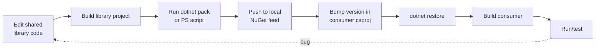
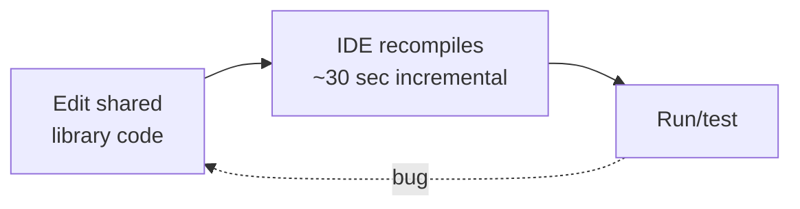

# NuGet vs Project References — The Hidden Inner-Loop Tax

> **Audience**: engineering managers, architects, product managers, and anyone deciding how shared C# libraries should be consumed inside the same team's solution.
>
> **Purpose**: quantify the cycle-time cost of consuming our own libraries as internal NuGet packages, and make the financial case for switching to `<ProjectReference>` for libraries we own and iterate on.
>
> **Status**: this document is a **standalone justification**. It can be approved independently of the broader local-development-environment investment (which it complements but does not depend on).

---

## TL;DR

Building our internal NuGet packages locally takes **6 minutes** (measured), and developers hit that loop **multiple times a day** — on every pull from the development branch, every branch switch, every iteration on a shared library, and at least once per rework cycle.

| Metric | Status quo (internal NuGet) | Target (ProjectReference) | Source |
|---|---|---|---|
| Local NuGet rebuild | **6 min** wall-clock per refresh | n/a (incremental compile) | `team-bug-data-raw.xlsx` |
| Median library-edit iteration | ~8 min (6 rebuild + 2 restore/version) | **~30 sec** | Conservative measured + benchmark |
| Cycle-time reduction per iteration | — | **94%** | Math |
| Annual team tax (placeholder team) | **~$48,000/year** | ~$15,000/year (publish for external consumers only) | `cost-model.xlsx → Nuget-vs-ProjectRef` |
| **Annual recoverable savings** | — | **~$33,000/year** | After residual publish cost |
| Migration cost (one-time) | — | **~$14,000** (80 hrs × 2 devs × $85/hr) | Estimate; pilot to validate |
| **Payback period** | — | **~5 months** | |
| 3-year cumulative net | — | **~$85,000** | |

These numbers are configurable on the `Inputs` tab of `cost-model.xlsx`. The spreadsheet is honest: the model is wired so this savings line can be **excluded** from the master ROI summary (toggle `apply_project_ref_savings` on the Inputs tab) if management wants to evaluate this investment in isolation.

---

## 1. The current inner loop

Today, when a developer changes a shared library that's consumed elsewhere in our solution:



**Real team data**: the documented dev process includes the literal step

> *"Build local NuGet packages with a PowerShell script."* — **6 minutes**

…and it appears again at step 21 of the 46-step process:

> *"Rebuild the NuGet packages if needed."*

Every loop above the dotted arrow is **wall-clock wait time**. Half is "idle" (developer context-switches to Slack/email), the rest is true context switch cost — DeMarco/Weinberg estimate 20-30% productivity loss per context switch.

## 2. With ProjectReferences



The consumer "sees" library changes immediately because the IDE/MSBuild treats the library as a regular project. No pack, no version bump, no restore, no consumer rebuild from scratch.

The cycle time drops from **~8 minutes to ~30 seconds** per iteration. Concretely, a developer making 10 iterations on a shared library during one feature gets back **~75 minutes**.

## 3. Where the cost comes from

The cost-model spreadsheet (`Nuget-vs-ProjectRef` tab) breaks the annual tax into three buckets:

### Bucket 1 — Daily pull/branch-switch tax (~$32,000/year)

Every `git pull` of the development branch or branch switch invalidates the local NuGet cache. Developers re-run the build-NuGet PowerShell script ~3 times per day on average.

```
team_size × rebuilds_per_dev_per_day × working_days × rebuild_min × idle_factor × context_switch_mult × hourly_rate
   8     ×           3              ×      250      ×     6      ×    0.6      ×       1.2          ×    $85
                                                                                                = ~$32,000/year
```

### Bucket 2 — Cross-package iteration tax (~$16,000/year)

When a developer is *actively iterating* on a shared library while building a feature, the loop fires every iteration. Conservative estimate: 12 extra rebuilds per cross-package feature, 18 cross-package features per dev per year.

```
team_size × cross_pkg_features × rebuilds_per_feature × rebuild_min × idle_factor × context_mult × rate
   8     ×        18           ×        12            ×     6       ×    0.6      ×    1.2       × $85
                                                                                            = ~$16,000/year
```

### Bucket 3 — Rework-cycle NuGet tax (~$300/year, but symbolic)

The team's documented 46-step process explicitly lists "Rebuild the NuGet packages if needed" as step 21 of the rework cycle. From the real Jan–May 2026 data: 26 rework items × (3.04 PRs avg − 1) × 1 rebuild per cycle × 6 min each. Small in isolation but a textbook example of how the friction compounds with every other inefficiency.

### Total status-quo tax: ~$48,000/year

## 4. What the migration costs

| Item | Estimate | Notes |
|---|---|---|
| Refactor labor (one-time) | **$13,600** | 80 hrs × 2 devs × $85/hr |
| Residual NuGet publish overhead (annual) | ~$500 | 12 external packs/year × 30 min each |
| Possible solution-build-time increase | TBD | Measure during pilot; mitigate with solution filters |
| Investment in MSBuild discipline / shared props | minimal | Likely already needed regardless |

## 5. When `<PackageReference>` is still the right call

Be honest with reviewers — there are real scenarios where keeping internal NuGet is correct:

| Scenario | Why PackageReference still wins | Recommended pattern |
|---|---|---|
| Library has **external consumers** (other teams, customers, SDK) | You must publish anyway; ProjectRef inside our solution + PackageRef in release pipeline | Hybrid via build targets |
| Library is **versioned for SLAs / change windows** | Pinned versions force consumers to opt-in to changes | Keep PackageRef for the discipline |
| Library lives in a **separate repo / separate solution** | ProjectRef across repos is fragile | Local feed + dotnet pack in a fast CI loop (or git submodule, but that has its own pain) |
| Solution build time would **exceed reasonable limits** (>5 min) | Massive monolithic SLN is its own problem | Use SLN filters (`*.slnf`) to slice; ProjectRef libs in the slice |
| Library is **closed-source / IP-sensitive** | NuGet feed gives audit + access control | Keep PackageRef |

**The hybrid pattern** (ProjectRef-in-dev, PackageRef-in-release) is well-established in .NET and is how this typically gets implemented in mid-size teams. It captures the inner-loop win while preserving the publish/versioning discipline for external consumers.

## 6. Migration approach (suggested)

This is a refactor, not a rewrite. Suggested phasing:

1. **Inventory (1 week, ~8 hrs)** — list every internal NuGet package, who consumes it, and whether it has external consumers.
2. **Pilot (1 sprint, ~20 hrs)** — pick the highest-iteration library (the one that hurts the most), convert one consumer to `<ProjectReference>`, measure cycle-time delta.
3. **Roll out (2-3 sprints, ~50 hrs)** — convert remaining in-solution consumers. Keep publish pipelines for external consumers.
4. **Solution hygiene (~10 hrs)** — add solution filters (`*.slnf`) for teams who don't need the whole graph; tune MSBuild incremental settings.

The migration is paid back within the first sprint of using ProjectReferences. Use the pilot's measured before/after times to confirm the model's assumptions before committing to the full roll-out.

## 7. Talking points for management / product management

When you present this to non-engineers, lead with **what they care about**, not with ProjectReference vs PackageReference:

- **Feature throughput**: "Today, working on a feature that touches a shared library costs developers ~75 minutes per feature in extra waiting. That's ~22 features-worth of wait per developer per year we don't ship."
- **Predictability**: "When a developer hits the NuGet rebuild loop, they typically context-switch to other work and lose 20-30% of the resumed productivity. This is a major source of estimate variance."
- **Risk**: "Anyone working on a shared library risks a 6-minute pause every iteration. New hires hit this in their first week and get a bad impression of our tooling."
- **Cost**: "$33K/year recovered. Payback in 5 months. No ongoing license cost, no infrastructure change."
- **Reversibility**: "We can roll this back per-library if it ever creates problems. The hybrid pattern means the release pipeline is unchanged."

## 8. Anticipated objections (and responses)

| Objection | Response |
|---|---|
| *"Solution build time will explode."* | "We'll measure on the pilot. If it exceeds the threshold we use SLN filters (`*.slnf`) — supported natively by Visual Studio and dotnet CLI — so each dev loads only the projects they need." |
| *"Versioning discipline will degrade."* | "External consumers (publish-to-feed targets) keep the same versioning. ProjectReference only applies to in-solution consumers, where versioning was previously meaningless because we always rebuilt-and-republished anyway." |
| *"What about CI build time?"* | "ProjectReference improves CI build time because we skip the pack-and-restore round-trip in CI." |
| *"Won't this couple our libraries to consumers tightly?"* | "Coupling is enforced by the .NET dependency graph, identical to PackageReference. The only difference is *when* the library binary is produced." |
| *"We tried this before and it didn't work."* | "Modern .NET tooling (since SDK 6.0+) handles ProjectReference much better. The pilot will tell us if the previous obstacles still apply." |
| *"This isn't urgent."* | "$33K/year compounds. At our marginal cost, every quarter we delay is one feature's worth of capacity lost." |

## 9. How this fits with the broader local-dev investment

This initiative is **independently approvable** but **compounds** with the broader local-development-environment investment described in [`business-case.md`](business-case.md):

- The local-dev-env investment removes the *outer loop* (push to shared env to verify).
- The ProjectReference change removes the *inner inner-loop* (build-pack-restore-build).

If both happen, the team gets a true sub-minute edit-test loop. If only one happens, the team gets significant but partial relief. The two investments do **not** double-count savings in the spreadsheet — the `apply_project_ref_savings` toggle on the Inputs tab lets you isolate this line.

## 10. How to use this document

- **Share standalone**: this `.md` file is self-contained. Send the link to library owners, architects, and the team building the justification.
- **For numbers**: the calculations live in `cost-model.xlsx → Nuget-vs-ProjectRef` tab. Adjust the inputs (rebuilds per day, % eliminable, migration cost) to reflect your team's reality.
- **For the deck**: pull the cycle-time table from Section 1 and the total cost from `Nuget-vs-ProjectRef!B<TOTAL>` cell. A single slide is usually enough.

## References

- Microsoft's [ProjectReference vs PackageReference guidance](https://learn.microsoft.com/en-us/visualstudio/msbuild/common-msbuild-project-items#projectreference) — confirms ProjectReference is the recommended pattern for libraries owned and iterated within the same solution.
- The .NET SDK [solution filter docs](https://learn.microsoft.com/en-us/visualstudio/ide/filtered-solutions) for mitigating large-solution build time.
- [Capers Jones, *Applied Software Measurement*](https://www.amazon.com/Applied-Software-Measurement-Productivity-Quality/dp/0071502440) — context-switch productivity loss data referenced above.
- The 46-step process and 6-minute NuGet rebuild measurement live in `team-bug-data-raw.xlsx` (anonymised and stored outside this repo).
